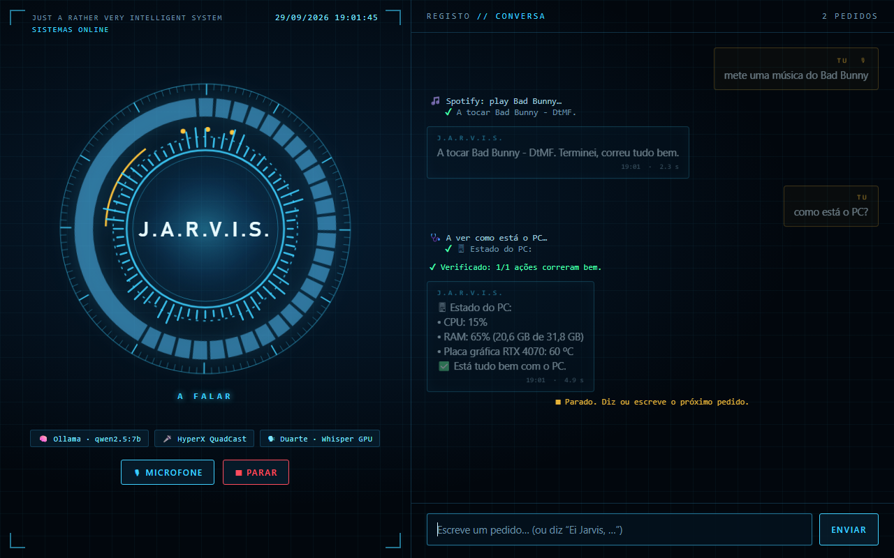
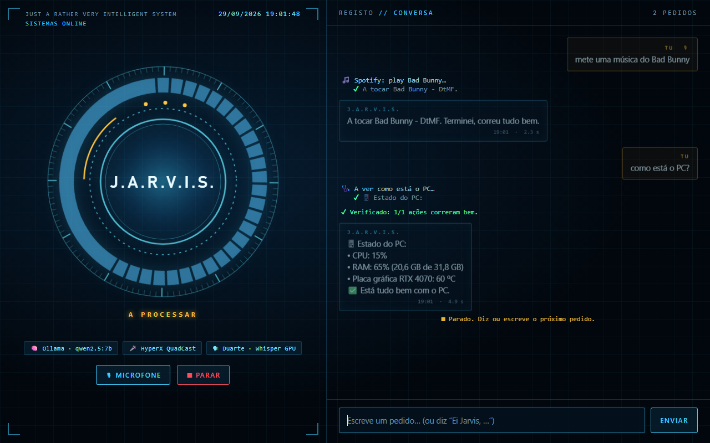

# J.A.R.V.I.S. — assistente pessoal para o PC

**Controla o computador por voz ou texto, em português de Portugal.** Abre apps, jogos e sites, põe música, lê e responde a mensagens no WhatsApp, Discord e Telegram, faz pesquisas, mostra memes no ecrã, diz como está o PC e aceita pedidos à distância pelo Telegram. O modelo de linguagem corre no teu PC (Ollama) ou na cloud (Gemini).




| A falar (o equalizador mexe com a voz) | A processar um pedido |
|---|---|
|  |  |


## O que faz

### ✨ No ecrã do PC
| Dizes | O Jarvis |
|---|---|
| "diz **olá** na tela do PC" (qualquer texto) | Mostra o texto em letras enormes e animadas durante 5 s |
| "mete um meme na tela do PC" | Lista os teus memes; escolhes o número e aparece em grande 10 s |
| "mete o meme do macaco" | Mostra esse meme logo, pelo nome |
| "da net" (depois da lista) | 5 memes novos da internet (Reddit, sem os impróprios) |
| Mandar uma **foto, GIF ou link do Tenor/Giphy** ao bot do Telegram | Guarda-o nos teus memes (a legenda passa a ser o nome) |
| "dá um jumpscare na tela do PC" | Cara assustadora em ecrã inteiro com um grito |

### 🖥 PC
| Dizes | O Jarvis |
|---|---|
| "como está o PC?", "faz um diagnóstico", "temperatura do PC" | CPU, RAM, disco, temperatura e uso da placa gráfica, o que gasta mais e as apps abertas |
| "fecha o PC" / "Windows L" | Pergunta, e com "sim" bloqueia o PC |
| "desliga / reinicia / suspende o PC" | Pergunta sempre antes; "cancela o desligar" trava-o |
| "manda-me um print do ecrã" | Print de todos os ecrãs, enviado no Telegram |
| "abre as transferências", "abre o meu CV", "o bluetooth não funciona" | Pastas, ficheiros e Definições do Windows |

### 🚀 Apps e jogos
- "abre o Spotify e a Steam", "fecha o WhatsApp": vários pedidos na mesma frase são feitos um a um; as apps abrem maximizadas.
- "abre o Valorant": abre o jogo (Riot, Battle.net, Steam, Epic), carrega no Play e põe o jogo à frente quando aparecer.
- "abre o Roblox", "abre o jogo Greenville no Roblox".
- "qual é o jogo com mais horas nos meus favoritos?", "faz um gráfico das minhas horas na Steam".

### 🎵 Música (Spotify)
- "mete uma música do Bad Bunny", "põe a playlist chill", "põe uma dos meus favoritos".
- "mete outra música", "salta", "pausa".
- "mete uma parecida" / "do mesmo género": vê o que está a tocar e escolhe uma parecida.
- "que música tem vibes iguais?": sugere 3; depois "mete uma dessas" ou "a segunda".
- Enquanto o Jarvis fala, a música e os jogos baixam de volume e depois voltam ao que estavam.

### ▶️ Vídeos, fotos e internet
- "põe um vídeo sobre gatos", "procura no TikTok…".
- "abre o último vídeo que vi no YouTube": abre o teu histórico do YouTube e carrega no primeiro.
- "mostra-me uma foto de um Audi": abre-a no PC e manda-a no Telegram.
- "mostra-me carros da Alpina à venda", "pesquisa no Google…": responde com os 5 primeiros links.
- "no Standvirtual pesquisa Mercedes de 100k para cima", "procura uma bicicleta no OLX até 200€": abre os resultados do próprio site, com filtro de preço. Depois, "e agora só até 20k" refaz a pesquisa.
- "quem ganhou o jogo do Benfica ontem?": resposta com pesquisa na net (precisa da chave grátis do Gemini).

### 💬 Mensagens
- "alguém me mandou mensagem?": vê o WhatsApp, o Discord (separado em amigos, grupos e servidores), o Instagram, o TikTok e o LinkedIn, e fecha o que abriu.
- Depois: "responde ao Rafael Pedro" (pergunta o texto e envia), "responde ao Rafael e diz já vou" (envia logo), ou "abre elas" / "o LinkedIn".
- "manda msg ao Rafosto no Discord" → "Que mensagem queres enviar?" → o texto vai tal e qual.
- "lê as mensagens do Rafosto no Discord", "responde à última mensagem que recebi no WhatsApp".
- Se estiveres a jogar, o Jarvis confirma que o texto ficou mesmo na caixa antes de enviar, e no fim devolve-te o jogo e o rato onde estavam.

### 💻 Código, IA e escola
- **"abre o VS Code"**: pergunta qual dos teus repositórios abrir (os mais recentes primeiro); respondes com o número ou o nome.
- **"escreve no Claude do VS Code que faça os testes"**: abre o Claude Code dentro do VS Code com o pedido já escrito.
- **"instala a extensão Prettier"** / "adiciona o plugin do Python": procura no Marketplace, mostra as mais instaladas e instala a que escolheres.
- "abre o TaskFlow no VS Code", "continua o trabalho no meu GitHub", "diz ao Claudinho para continuar".
- "abre o Claude" (pergunta se é no browser ou na app), "que conversas tenho no Claude?", "abre a segunda".
- "faz-me uma imagem de…" (ChatGPT), "faz-me um script que…" (Claude).
- **"faz um trabalho"**: Google Classroom → escolhes a turma → escolhes um dos 10 trabalhos mais recentes → o Jarvis manda ao Claude o enunciado e o texto dos anexos (PDF, Docs, Slides), a pedir o trabalho feito, um PowerPoint e um prompt para o Claude Design.

### 📱 Telegram (à distância)
- Qualquer pedido acima, escrito ao teu bot.
- **/aovivo**: os ecrãs do PC quase em tempo real (a foto atualiza a cada 2 s durante 1 minuto); **/aovivo 2** só o 2.º ecrã; **/parar** acaba.
- **/ajuda**: a lista de comandos; **/reiniciar**: carrega a versão mais recente do Jarvis.

### Respostas curtas
Depois de o Jarvis oferecer alguma coisa, podes responder só "sim", "quero", "mete uma dessas", "2", "a segunda" ou "não": ele lembra-se do que estavam a falar.

## Instalar e abrir (Windows)

Precisas de Python 3.11+ e de **um** destes:

- **Ollama** (predefinição, grátis e local): instala em https://ollama.com. O instalador descarrega o `qwen2.5:7b` (≈4,7 GB).
- **Gemini** (cloud): cria uma chave grátis em https://aistudio.google.com/apikey e põe no `.env` `JARVIS_PROVIDER=gemini` e `GEMINI_API_KEY=...`. Mesmo com o Ollama, a chave do Gemini serve para as respostas com pesquisa na net.

1. Duplo clique em **`install.bat`**: cria o ambiente Python, instala tudo e põe um atalho **Jarvis** no ambiente de trabalho.
2. Abre o Jarvis pelo atalho ou com duplo clique em **`Jarvis.bat`**. Abre a **janela com o HUD**:
   - fala começando por **"Ei Jarvis, …"** ou escreve na caixa em baixo;
   - **■ Parar** (ou `Esc`) corta a voz e cancela o resto do pedido;
   - **🎙 Microfone** liga e desliga a escuta.
3. Configurações de uma vez (opcionais): `Jarvis.bat --telegram` (bot do Telegram), `Jarvis.bat --classroom` (Google Classroom), `Jarvis.bat --testar-jarvis` (testar o "Hey Jarvis").

Preferes o terminal? `Jarvis.bat --terminal` (escolhes Escrever, Falar ou Mãos-livres) ou `--modo texto|falar|maos-livres`.

### Ollama ou Gemini?

| | Ollama (local) | Gemini (plano gratuito) |
|---|---|---|
| Qualidade (escolher ações, português de Portugal) | Razoável com modelos de 7B | Bastante melhor |
| Privacidade | Tudo fica no PC | As mensagens lidas vão para a Google |
| Custo e limites | Grátis, sem limites | Grátis, com limite de pedidos por dia |
| Internet | Não precisa | Precisa |
| Requisitos | ≈5 GB de RAM/VRAM | Nenhum |

## Voz

- **Só reage a frases que começam por "Ei Jarvis"** (ou "Hey Jarvis"): assim não apanha conversas com outras pessoas. O "Hey Jarvis" é detetado localmente (openWakeWord) mesmo com música, e só conta se vier no início da frase.
- **Gravação:** deteção de voz (Silero VAD), não o volume; o ruído do jogo não conta como fala e as pausas não cortam a frase.
- **Reconhecimento:** Whisper `large-v3-turbo` local. Na GPU NVIDIA demora ~0,5 s por frase; sem GPU passa para o `small` no CPU.
- **Resposta falada:** voz neural portuguesa (Duarte ou Raquel, `edge-tts`), com o estilo "JARVIS" (mais grave e com um efeito digital) em `JARVIS_VOICE_STYLE=jarvis`. Sem internet usa as vozes do Windows.
- **Perceber-te melhor (voz e texto):** antes de executar, o Jarvis corrige o que ouviu ou leu, e mostra "Entendi: …" quando muda alguma coisa.
  - Nomes mal ouvidos ou mal escritos: "Lavaloranti" → Valorant, "Cláudio" → Claudinho, "espotifai" → Spotify, "Steem" → Steam, e nomes parecidos com as tuas apps, jogos, contactos e projetos.
  - Gralhas no verbo ("abrre", "pesqisa") e hesitações ("epá", "hã", "isto, isto, isto").
  - O Whisper recebe a lista dos teus nomes (apps, jogos, contactos) como dica, por isso acerta mais à primeira.
  - O pedido pode vir depois de outra conversa na mesma gravação: "O André desapareceu. Ei Jarvis, abre o Roblox" executa só "abre o Roblox". Continua a ser preciso dizer "Ei Jarvis" (a meio da frase, "o Jarvis é fixe" não conta).
- **Contactos:** em `contactos.txt` (fora do git), uma pessoa por linha: `Nome como aparece = formas como o dizes` (ex.: `Rafosto = rafa, rafael`).

## Onde ficam as coisas

- **Ambiente de Trabalho\Jarvis**: `Fotos`, `Prints`, `Gráficos` e `Memes` (apagados ao fim de 7 dias) e **`Meus memes`** (nunca apagados).
- `.jarvis/`: registo (`jarvis.log`), sessões e chaves (Telegram, Google). Fica fora do git.

## Configuração (`.env`)

| Variável | Predefinição | Descrição |
|---|---|---|
| `JARVIS_PROVIDER` | `ollama` | `ollama` ou `gemini` |
| `JARVIS_OLLAMA_MODEL` | `qwen2.5:7b` | Modelo do Ollama (tem de suportar tools) |
| `GEMINI_API_KEY` | — | Chave do Gemini (também para respostas com pesquisa na net) |
| `JARVIS_GEMINI_MODEL` | `gemini-3.8-flash` | Modelo do Gemini |
| `JARVIS_BROWSER` | `default` | `opera`, `chrome`, `firefox`, `brave`, `edge` ou caminho do .exe |
| `JARVIS_MIC` | automático | Parte do nome do microfone |
| `JARVIS_TTS_VOICE` | `pt-PT-DuarteNeural` | Ou `pt-PT-RaquelNeural` |
| `JARVIS_VOICE_STYLE` | `normal` | `jarvis` para a voz estilo JARVIS |
| `JARVIS_DUCK` | `0.2` | Volume das outras apps enquanto o Jarvis fala (1 = não baixar) |
| `JARVIS_FOLLOW_UP` | `0` | Segundos depois de responder em que aceita frases sem "Jarvis" |
| `JARVIS_WAKE_THRESHOLD` | `0.3` | Sensibilidade do "Hey Jarvis" (0 desliga) |
| `JARVIS_END_SILENCE` | `3` | Segundos de silêncio que terminam a gravação |
| `JARVIS_MAXIMIZE` | `1` | Abrir as apps maximizadas |
| `JARVIS_KEEP_DAYS` | `7` | Dias até apagar fotos, prints e gráficos (0 = nunca) |
| `JARVIS_OUTPUT_DIR` | Ambiente de Trabalho\Jarvis | Outra pasta para o que o Jarvis cria |
| `JARVIS_MESSAGING` | `auto` | WhatsApp/Discord: app de desktop (`auto`/`desktop`) ou `web` |
| `JARVIS_CONFIRM_SEND` | `1` | Confirmar antes de enviar mensagens ditadas |
| `JARVIS_CONFIRM_AI_REPLIES` | `1` | Mostrar as respostas escritas pelo Jarvis antes de enviar |
| `JARVIS_TELEGRAM_TOKEN` / `JARVIS_TELEGRAM_ALLOWED_IDS` | — | Bot do Telegram e IDs autorizados (`--telegram` preenche) |

## Segurança

- **Telegram:** só aceita mensagens dos IDs autorizados; os outros são ignorados. Pedidos que chegaram com o Jarvis desligado não são executados de repente.
- **Ações sensíveis** (lançar o Claude Code a mexer em código) pedem confirmação com botões ✅/❌. Desligar, reiniciar ou bloquear o PC pergunta sempre antes.
- **Mensagens:** quando ditas o texto, é enviado tal e qual (não o que o modelo reescreveria). Antes de enviar, o Jarvis confirma pelo nome que a conversa aberta é a certa; se não for, não envia.
- As mensagens lidas vão para o modelo marcadas como conteúdo de terceiros, para ele não seguir instruções escritas nelas.
- Google Classroom só com permissões de leitura.

## Fiabilidade com modelos locais

Os pedidos mais comuns (música, mensagens, memes, pesquisas em sites, desligar o PC, diagnóstico, respostas curtas) são reconhecidos diretamente, sem depender do modelo. Para o resto, se o modelo responder "abri o Spotify" sem ter feito nada, o Jarvis tenta outra vez só com o pedido atual e, se mesmo assim nada for feito, diz que não conseguiu. No fim de cada pedido confere o resultado de todas as ações ("Verificado: 2/2 ações correram bem").

## Estrutura

```
jarvis/
  main.py            # ciclo do Jarvis (janela ou terminal)
  gui/               # janela com o HUD (pywebview + HTML/SVG)
  brain.py           # atalhos + o modelo escolhe ferramentas, o Jarvis executa-as
  tools.py           # ferramentas disponíveis e execução
  followups.py       # "sim", "mete uma dessas", "2"…
  music_intents.py   # pedidos de música sem o modelo
  power_intents.py   # bloquear / desligar / reiniciar com pergunta
  memes.py overlay.py  # memes, texto e jumpscare no ecrã
  ducking.py         # baixar o som das outras apps enquanto fala
  understand.py      # corrige nomes mal ouvidos/escritos, gralhas e hesitações
  voice.py           # microfone, Whisper, "Hey Jarvis", voz neural
  telegram_bot.py remote.py  # controlo pelo Telegram (+ /aovivo)
  llm/               # Ollama e Gemini com a mesma interface
  actions/           # apps, jogos, Spotify, YouTube, WhatsApp/Discord, sites, Classroom, diagnóstico…
tests/               # pytest (419 testes)
```

## Testes

```bash
.venv\Scripts\python -m pytest
```
